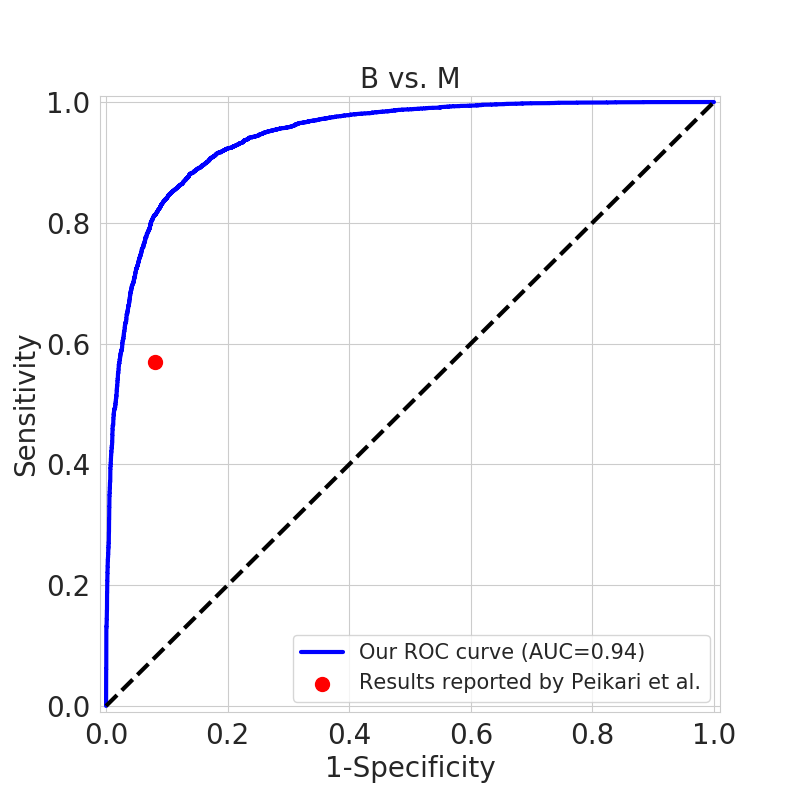

# nuclei_detection
The nuclei detection method on histology image proposed by Peikari et al.  
The code will be available by the publication of the paper.

# Nuclei detection in histology images
This is our implementation of the method proposed in [[Peikari et al.]](#references).

## Overview
The detection is comprised of two parts: segmentation and classification. 
The segmentation is based on color deconvolution, multi-level Otsu thresholding and marker-controlled watershed.
Classification of individual nuclei is based on SVM using shape, intensity and texture features.

## Data
The data is provided as a part of the SPIE-AAPM-NCI BreastPathQ: Cancer Cellularity Challenge 
(http://spiechallenges.cloudapp.net/competitions/14 or https://breastpathq.grand-challenge.org/).

## Results
The ROC curves of classification of lymphcyte/epithelial (L vs. BM) and benign/malianant (B vs. M):<br><br>
<br>

Examples of nuclei segmentation and detection:<br><br>
<br><br>

The accuracy, sensitivity and specificity of nuclei classification on the test set:

|Class|ACC|SEN|SPE|
|---|---|---|---|
|Lymphocyte|0.960|0.840|0.981|
|Benign|0.878|0.577|0.928|
|Malignant|0.890|0.927|0.802|

This implementation got ICC of 0.76 [0.69, 0.81], Kendall's tau-b of 0.57 [0.49, 0.63] and 
Prediction Probability (the metric adopted by the challenge organizer) of 0.79 [0.75, 0.82] on the validation set.

## Dependencies
Python3  
[Scikit-images](https://scikit-image.org/)  
[OpenCV](https://pypi.org/project/opencv-python/)  
[MATLAB Engine API for Python](https://www.mathworks.com/help/matlab/matlab-engine-for-python.html)  
[GLCM_Features4](https://ww2.mathworks.cn/matlabcentral/fileexchange/22354-glcm_features4-m-vectorized-version-of-glcm_features1-m-with-code-changes)
(Make sure that the function `GLCM_Features4` is within your MATLAB Path)  
[Scikit-learn](https://scikit-learn.org)  
Standard scientific Python stack: `NumPy, Pandas, SciPy, Matplotlib`

## How to run
1.  Download the dataset from  http://spiechallenges.cloudapp.net/competitions/14 and copy the images to the corresponding directories in `data/`.
Please note that the training images should be copied to `data/corr/` (for the purpose of linear correction).
2.  To segment the nuclei for all the images, run:
    ```
    python3 peikari.py --phase train val corr --precomputed_threshold
    ```
    The segmentation mask of each phase will be stored in `segmentation&classification/PHASE/seg.npy`. 
    In each mask, the the background is denoted by 0 and the region of each nuclus is denoted by a specific positive integer.  
3.  To stack the images into array to speedup loading, run:
    ```
    python3 make_data.py --opt stack --phase cells
    python3 make_data.py --opt stack --phase val
    python3 make_data.py --opt stack --phase corr
    ```
    The images will be stacked in `data/PHASE/x.npy` and the ground truth of cellularity will be stored in `data/PHASE/y.npy`. 
4.  To get the annotations of nuclei from `xml` files and store them in an array, run:
    ```
    python3 make_data.py --opt get_annotation
    ``` 
    The annotations will be stored in `segmentation&classification/cells/annotation.npy`.
    Lymphcyte, benign and malignant epithelial nuclei are denoted by 2, 1, 0 respectively in the third column.
5. To generate centroids from the segmentation masks, run:
    ```
    python3 make_data.py --opt get_centroid --phase cells
    python3 make_data.py --opt get_centroid --phase val
    python3 make_data.py --opt get_centroid --phase corr
    ```
    The centroids will be stored in `segmentation&classification/PHASE/centroid.npy`.
6.  To match the segmented nuclei to the manual annotations, run:
    ```
    python3 make_data.py --opt match
    ``` 
    The result of matching will be stored in `segmentation&classification/cells/anno_match.npy`.
7.  To manually check the segmentation results, run:
    ```
    python3 make_data.py --opt mark_countour --phase cells
    python3 make_data.py --opt mark_countour --phase val
    python3 make_data.py --opt mark_countour --phase corr
    ```
    You can browse the images in `segmentation&classification/PHASE/seg_contour` to review your segmentation.
8.  To extract features describing shape, intensity and textures, run:
    ```
    python3 make_data.py --opt extract_nuclei&intensity --phase cells
    python3 make_data.py --opt extract_nuclei&intensity --phase val
    python3 make_data.py --opt extract_nuclei&intensity --phase corr
    python3 make_data.py --opt extract_shape&lbp --phase cells
    python3 make_data.py --opt extract_shape&lbp --phase val
    python3 make_data.py --opt extract_shape&lbp --phase corr
    python3 make_data.py --opt extract_haralick --phase cells
    python3 make_data.py --opt extract_haralick --phase val
    python3 make_data.py --opt extract_haralick --phase corr
    ```
    The features will be stored in `segmentation&classification/PHASE/features/`.
9.  To train SVMs to classify lymphcyte/epithelial and benign/malianant, run:
    ```
    python3 classify.py --opt lvsbm
    python3 classify.py --opt bvsm
    ```
    The SVMs will be pickled to `segmentation&classification/model/`, along with the ROC curves of 5-fold cross validation.
10. To validate the models on the test set, run:
    ```
    python3 classify.py --opt validate
    ```
11. To predict the cellularity of the validation set, run:
    ```
    python3 classify.py --opt predict
    ```
    The prediction on the validation set will be stored in `segmentation&classification/pred_val.csv`, along with the ground truth.

## References
If you find this repository useful for your publication, please star it and consider citing the following papers:  

**The original idea**  
Peikari, M., Salama, S., Nofech‐Mozes, S., & Martel, A. L. (2017). 
Automatic cellularity assessment from post‐treated breast surgical specimens. 
Cytometry Part A, 91(11), 1078-1087.

**This implemantation**  
Pei Z., Cao S., Lu L., & Chen W-F. (2019). 
Direct cellularity estimation on breast cancer histopathology images using transfer learning. 
Computational and Mathematical Methods in Medicine, 2019, 3041250.
